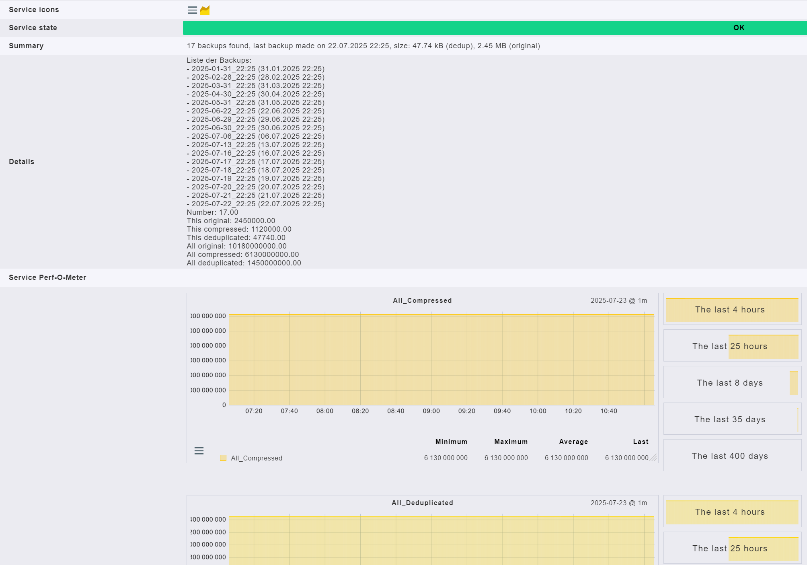

# Checkmk Local Check for BorgBackup

Monitor your **BorgBackup** effortlessly with this local check for Checkmk. The script provides detailed backup information, status, warnings, and performance data directly in your Checkmk interface.

# Introduction

This script is a comprehensive local check for integrating **BorgBackup** state and history into Checkmk monitoring. It provides:

*   The number and timestamps of existing backups
*   Deduplicated and original sizes
*   Warnings for missing or failed backup paths
*   Status of running backups and compaction processes
*   Full list of individual backup archives with human-readable times

# Prerequisites

*   Linux/Unix system with Bash
*   BorgBackup (`borg`)
*   Uses system tools: `ps`, `pgrep`, `awk`, `sed`, `grep`, `date`, and standard shell utilities
*   Relies on a configuration script `/sicherung/borg_backup.sh` (or `/backup/borg_backup.sh`), as commonly used in deployments

Within your `borg_backup.sh` configuration, set variables as follows:

```
#!/bin/bash

#####################################
# Name of the repository to be initiated
HOST=[server.tld]
# name of the subaccount (only for Hetzner storage)
SUB=[x]
# Passphrase of the initiated repository, avoid special characters
PHRASE=12345678dfe5unzfdcfdmHNTGWAV432234567899876543
#####################################

# Borg repo at Hetzner, you can also use a local path if you want
export BORG_REPO="ssh://[user]-sub[x]@[user].your-storagebox.de:23/./backup/$HOST"
export BORG_PASSPHRASE="$PHRASE"

[...] # rest of the script
```

# Installation

Copy the script `check_borg_backup` into the following directory on your Checkmk client:

```
/usr/lib/check_mk_agent/local
```

Make the script executable:

```
chmod +x /usr/lib/check_mk_agent/local/check_borg_backup
```

# Activate in Checkmk

After installation, **restart your Checkmk agent service**.  
Then, rescan the server in Checkmk. The new "BorgBackup" service entry will appear in the monitoring view.

# Example Output in Checkmk

The service entry includes:

*   Summary with:
    *   Number of backups
    *   Date and time of the last backup
    *   Deduplicated size and original size of the last backup
*   A list of all backup archives with their name and time
*   Performance graphs for key metrics




## Summary

*   Number of backups
*   Date/time of last backup
*   Deduplicated and original size of the last backup

## Details

*   List of all archives (name and date)

## Performance data

*   Graph for each of:
    *   Number of backups
    *   "This backup" original, compressed, deduplicated size
    *   "All backups" original, compressed, deduplicated size

## Status Output

*   OK: All recent backups present, no warnings
*   Warning: Last backup older than 28 hours
*   Critical: Last backup older than 3 days, symbolic link detected in backup source, or log shows critical error/missing directories
*   Special output for currently running backup or compaction operation

# Logfile and Symbolic Links Checks

*   Script detects errors in `/sicherung/borg_backup.log` or `/backup/borg_backup.log` about missing directories and reports them in detail
*   Script checks for symbolic links in backup source paths and fails with **CRITICAL** if found

# Troubleshooting

*   If you see a warning about missing `borg_backup.sh`, ensure the configuration script is present in `/sicherung` or `/backup`
*   Ensure all dependent programs and permissions are in place

# Changelog

*   **v2.1.1**: added `/backup` to possible script locations
*   **v2.2.0**: logfile parsing for failed directories
*   **v2.2.3**
    *   failsafe check for running `borg_backup.sh` process
    *   check for borg compact process
    *   extended time-based checks for compaction
    *   refactored variable handling
*   **v2.3.0**: forced update (version bump)
*   **v2.3.1**: check for symbolic links in backup paths

# Author

*   Author: **Sascha Jelinek**
*   Company: **ADMIN INTELLIGENCE GmbH**
*   Website: [www.admin-intelligence.de/checkmk](https://www.admin-intelligence.de/checkmk)