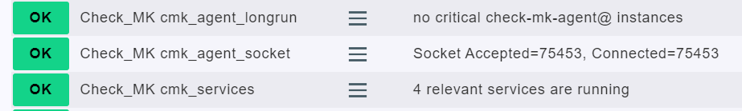

# Checkmk Agent Remote Service Monitor

This script monitors the **Checkmk agent services** on a list of remote servers via SSH and outputs results into **Checkmk piggyback files** for further monitoring.  
It checks the status of critical systemd units, verifies socket activity, and detects long-running `check-mk-agent@` instances.

**Note:** This local check must be run on the Checkmk server itself, not on the monitored hosts.



# Features

*   Verifies that required Checkmk services and timers are installed and running.
*   Detects missing or inactive services with detailed error output.
*   Monitors the **check-mk-agent.socket** for accepted and connected requests.
*   Checks if socket activity has stalled (no new accepted connections in the last 5 minutes).
*   Detects long-running agent subprocesses (`check-mk-agent@...`) that exceed a configured runtime.
*   Outputs results as a **Checkmk piggyback section** per monitored server.

# Requirements

*   **Bash** (tested with GNU Bash 5+)
*   `ssh` access to all target servers (root login or a user with sufficient permissions)
*   `systemd` on all monitored servers
*   Checkmk agent installed (`check-mk-agent`, `cmk-agent-ctl`, `cmk-update-agent`)

# Installation

## **Clone or copy the script** into the Checkmk agent directory:

```
sudo mkdir -p /usr/lib/check_mk_agent/local
sudo cp check_cmk_remote_services.sh /usr/lib/check_mk_agent/local/
sudo chmod +x /usr/lib/check_mk_agent/local/check_cmk_remote_services.sh
```

## **Create the server list file** with all target hostnames (one per line):

```
sudo tee /usr/lib/check_mk_agent/servers_for_cmk_servicechecks <<EOF
server1.example.com
server2.example.com
server3.example.com
EOF
```

## **Ensure SSH key authentication is configured** for the root (or monitoring) user:

```
ssh-copy-id root@server1.example.com
```

Repeat for all servers listed in the file.

## **Test the script manually**:

```
/usr/lib/check_mk_agent/local/check_cmk_remote_services.sh
```

You should see CheckMK-formatted output like:

```
<<<<server1.example.com>>>>
<<<local>>>
0 "Check_MK cmk_services" - 4 relevant services are running
0 "Check_MK cmk_agent_socket" - Socket Accepted=42, Connected=3
0 "Check_MK cmk_agent_longrun" - no critical check-mk-agent@ instances
<<<<>>>>
```

# How it Works

*   Reads server names from:  
    `/usr/lib/check_mk_agent/servers_for_cmk_servicechecks`
*   For each server:
    *   Checks for required systemd units:
        *   `check-mk-agent-async.service`
        *   `check-mk-agent.socket`
        *   `cmk-agent-ctl-daemon.service`
        *   `cmk-update-agent.timer`
    *   Evaluates if the socket is active and processing connections.
    *   Tracks if socket activity remains unchanged for more than **5 minutes**.
    *   Checks if `check-mk-agent@` units are running unusually long.
*   Writes monitoring output into:  
    `/var/lib/check_mk_agent/spool/piggy_<hostname>.txt`

# Integration in Checkmk

Piggyback data will be automatically picked up by Checkmk as long as:

1.  The local script is executable under the **Checkmk agent local plugin folder**.
2.  The monitored hosts exist in Checkmk with names matching the server list entries.
3.  You run a new service discovery in Checkmk after deploying.

# Configuration Options

*   `**SOCKET_MAX_AGE**` (default `300` seconds):  
    Maximum allowed inactivity time for socket `Accepted` values before triggering a CRIT.
*   `**SERVER_LIST_FILE**` (default `/usr/lib/check_mk_agent/servers_for_cmk_servicechecks`):  
    Path to the list of servers to monitor.

# Example Output in Checkmk

## **OK state:**

```
Check_MK cmk_services        OK - 4 relevant services are running
Check_MK cmk_agent_socket    OK - Socket Accepted=57, Connected=4
Check_MK cmk_agent_longrun   OK - no critical check-mk-agent@ instances
```

## **Problem state:**

```
Check_MK cmk_services        CRIT - 3 relevant services are running, NOT running: check-mk-agent.socket (inactive)
Check_MK cmk_agent_socket    CRIT - check-mk-agent.socket Accepted value (12) has not increased for over 5 minutes
Check_MK cmk_agent_longrun   CRIT - check-mk-agent@123.service has been running for 2d 5h 32m 10s
```

# Author

*   Author: **Sascha Jelinek**
*   Company: **ADMIN INTELLIGENCE GmbH**
*   Website: [www.admin-intelligence.de/checkmk](https://www.admin-intelligence.de/checkmk)