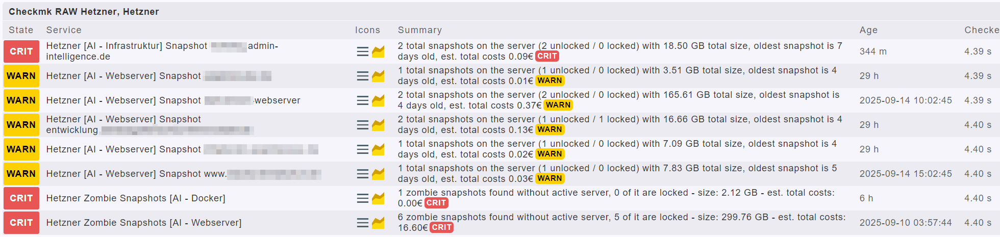
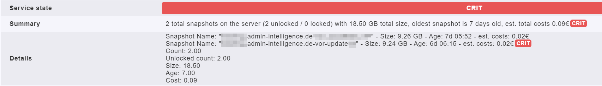

# Hetzner Snapshots Local Check for Checkmk

With this local check you can parse all available snapshots from your Hetzner projects and display them clearly within Checkmk.

## Overview



## Details view



# Requirements

You need an `api_keys` file in the folder `/usr/lib/check_mk_agent/` on your system.  
A sample file is included in the project folder.

## Additional packages:

```
apt -y install curl jq
```

# Functionality & Best Practices

Depending on the number of projects and servers, API requests may take longer.  
It is recommended to run this as a **cronjob**, writing the result to a text file for Checkmk to read as a local check.

# Installation

Depending on the number of projects and server this script can run a significant amount of time. So I recommend to let this script run in the background as a cronjob and then simply read a created textfile as a local check.

Therefore I would suggest the following installation:

## 1\. Copy the files

Place the scripts in the desired directory.  
Ensure the Checkmk agent is installed on the server.

| script name | target path |
| --- | --- |
| `check_hetzner_buffer.sh` | `/usr/lib/check_mk_agent/` |
| `check_hetzner.sh` | `/usr/lib/check_mk_agent/` |
| `check_hetzner_snapshots.sh` | `/usr/lib/check_mk_agent/local/` |
| `api_keys` | `/usr/lib/check_mk_agent/` |

## 2\. Set up a cronjob

Example for your crontab (adjust depending on number of servers):

`0,10,20,30,40,50 * * * * /usr/lib/check_mk_agent/check_hetzner_buffer.sh >/dev/null 2>&1`

## 3\. Create a host in Checkmk

Create a host in Checkmk with the name **Hetzner**.

The script generates piggyback data for this hostname so the snapshot results appear in the correct service.

## 4\. Fill the API keys

For each project, create a **read-only API key** entry in the file, e.g.:

```
#Customer;Projectname;API-Key
Example;Demo-Project;w743z9tn39tvc793zv73znv93z4ntvzmv93zh83nmzvt08nz3mv83
```

Add one project/key per line.

In the screenshots provided this is shown like this:

Hetzner \[_Customer_ - \_Projectname\_\] Snapshot _servername at Hetzner_

# Result in Checkmk

*   Overview: Number and age of snapshots per project, directly in monitoring
*   Details: Snapshots for each server including timestamp, name & project
*   Warnings possible for outdated snapshots or other thresholds
*   Full integration as a service on the "Hetzner" Checkmk host
*   Piggyback data supports multi-project / multi-customer setups

# Notes & Tips

*   Regularly check your snapshots in the Hetzner panel
*   Never use write-permission API keys!
*   For troubleshooting: check cron logs and agent output

# Author

*   Author: **Sascha Jelinek**
*   Company: **ADMIN INTELLIGENCE GmbH**
*   Website: [www.admin-intelligence.de/checkmk](https://www.admin-intelligence.de/checkmk)