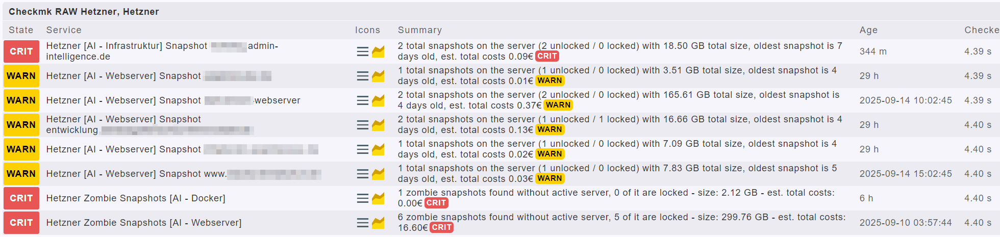
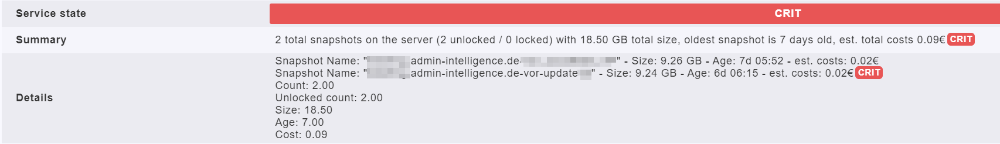

# Description

With this local check you can parse your Hetzner projects for available snapshots and display them within Checkmk.

## Overview



## Details view



# What you need
You need to place the file `api_keys` in the folder `/usr/lib/check_mk_agent`.

A sample file is included in this folder.

## Other prerequisites

You need to install the following packages on the server:

```
apt -y install curl jq
```

# Instructions

Depending on the number of projects and server this script can run a significant amount of time. So I recommend to let this script run in the background as a cronjob and then simply read a created textfile as a local check.

Therefore I would suggest the following installation:

## 1. Copy the files

On the Checkmk server itself copy the files into the desired folders. I assume that the Checkmk agent is also installed on the Checkmk server.

| script name                  | target path                      |
| ---------------------------- | -------------------------------- |
| `check_hetzner_buffer.sh`    | `/usr/lib/check_mk_agent/`       |
| `check_hetzner.sh`           | `/usr/lib/check_mk_agent/`       |
| `check_hetzner_snapshots.sh` | `/usr/lib/check_mk_agent/local/` |
| `api_keys`                   | `/usr/lib/check_mk_agent/`       |

## 2. Create a cronjob entry

The cronjob can look like this, depending on the amount of servers:

`0,10,20,30,40,50 * * * * /usr/lib/check_mk_agent/check_hetzner_buffer.sh >/dev/null 2>&1`

## 3. Create a host in Checkmk with the name "Hetzner"

The local check is designed the way that it creates piggyback data for a host with the name **Hetzner**.

## 4. Fill the API keys

now you simply need to create a read-only API key for each project in your Hetzner account.

In the file you can add a new line for each customer or project.

```
#Customer;Projectname;API-Key
Example;Demo-Project;w743z9tn39tvc793zv73znv93z4ntvzmv93zh83nmzvt08nz3mv83
```

In the screenshots provided this is shown like this:

Hetzner [*Customer* - *Projectname*] Snapshot *servername at Hetzner*