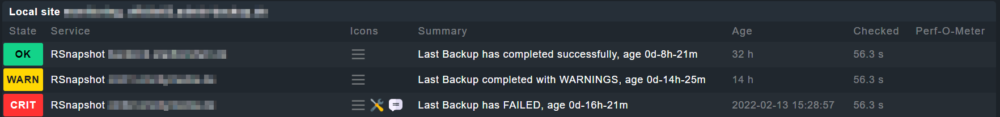

# Checkmk Local Check – rsnapshot Backup Status

A shell script for monitoring `rsnapshot` backups via Checkmk. It checks the age and success of backups in your rsnapshot folders and reports status directly to the monitoring agent, giving instant visibility in Checkmk.

# Usage

## **1\. Copy the script** to the Checkmk agent local checks directory on your client:

```
/usr/local/check_mk_agent/local/check_rsnapshot.sh
```

## **2\. Make it executable:**

```
chmod +x /usr/local/check_mk_agent/local/check_rsnapshot.sh
```

## **3\. Configure the backup path:**

Either set the `BACKUPPATH` variable inside the script  
**OR**  
pass it as a parameter when calling the script:

```
/usr/local/check_mk_agent/local/check_rsnapshot.sh /your/rsnapshot/root/folder
```

If not specified, edit the script and set `BACKUPPATH="[your rsnapshot root folder]"`.

# How It Works

*   For each folder in `BACKUPPATH`, the script checks for an `rsnapshot.log` file.
*   It parses the last entry in the log to determine backup result and calculates elapsed time since the backup.
*   Reports status based on age:
    *   **OK (0):** Recent, successful backup
    *   **WARN (1):** Successful but older than warning threshold (`WARN`, default 2 days)
    *   **CRIT (2):** Successful but older than critical threshold (`CRIT`, default 3 days), or backup failed
*   Also detects backups completed with warnings and running backups.
*   Entire status is passed as a Checkmk local check line for each rsnapshot folder.

# Example Output

A typical output line per backup folder:

```
0 "RSnapshot Hourly" - Last Backup has completed successfully, age 0d-2h-15m
1 "RSnapshot Daily" - Last Backup has completed successfully, but is too old with 2d-1h-4m
2 "RSnapshot Weekly" - Last Backup has FAILED, age 3d-0h-8m
```

A missing log file:

```
2 "RSnapshot Daily" - no rsnapshot.log found!
```

# Screenshot

If configured correctly, the output in Checkmk will look like:  


# Integration and Monitoring

*   On each agent run, Checkmk will ingest the script output and display backup age/status for each rsnapshot interval.
*   Set thresholds for notifications in Checkmk based on warning and critical states.
*   Use graphs and alerting for backup aging and failed runs.

# Changelog

*   **v1.0.0:** initial release

# Author

*   Author: **Sascha Jelinek**
*   Company: **ADMIN INTELLIGENCE GmbH**
*   Website: [www.admin-intelligence.de/checkmk](https://www.admin-intelligence.de/checkmk)