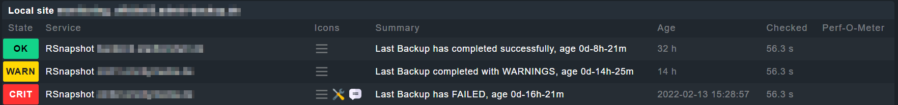

# Usage

1. To use this script, just copy it to the `/usr/local/check_mk_agent/local` folder on your client with the agent installed.
2. Set the execution bit on the file to make it executable: `chmod +x /usr/local/check_mk_agent/local/check_rsnapshot.sh`
3. Then either adjust the variable `BACKUPPATH` or pass it with the command `/usr/local/check_mk_agent/local/check_rsnapshot.sh BACKUPPATH`

# Screenshot(s)
if everything works correctly it should look like this:
