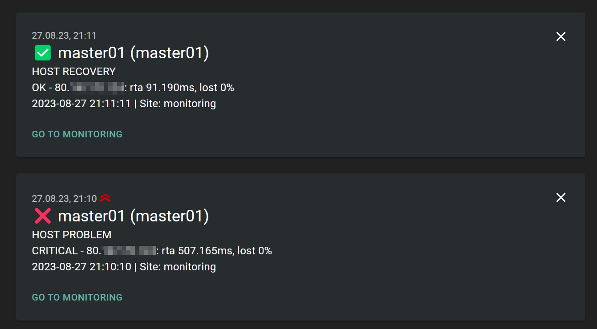
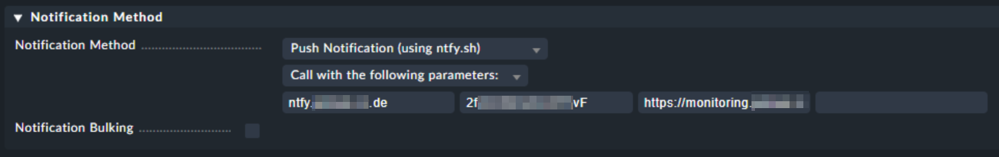

# General

Since were are using ntfy.sh as our new push service and I couldn't find an appropriate script for I built one myself.

It also has a link to the actual host or service so that you are able to jump directly to that host or service without opening the monitoring and search for the host or service.

The script is actual work in progress, but it is working fine as for now.

# Installation

Just copy the script to the following folder on your Checkmk server installation and set the executable flag:

~~~
$OMD_ROOT/local/share/check_mk/notifications
~~~

Now you can select the notifiction type from your settings:

# Configuration

To configure the notification method, fill in the first 3 parameters with the following content:

1. Hostname of your ntfy.sh-Server. It needs to be accessible via HTTPS.
2. Channel name created within your ntfy.sh server
3. URL to your monitoring system (only the part before the first "/")
4. *(optional)* username for basic auth
5. *(optional)* password for basic auth, without special characters (I would suggest a passphrase, eg. "Cringing-Antibody-Unclothed0")

# TODOs

- [x] add "basic auth" for ntfy.sh server