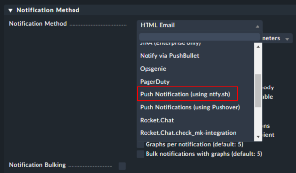

# General

Since were are using ntfy.sh as our new push service and I couldn't find an appropriate script for I built one myself.

The script is actual work in progress, but it is working fine as for now.

# Installation

Just copy the script to the following folder on your Checkmk server installation:

~~~
/opt/omd/sites/[sitename]/share/check_mk/notifications
~~~

Now you can select the notifiction type from your settings:

# Configuration

To configure the notification method, fill in the first 3 parameters with the following content:

1. Hostname of your ntfy.sh-Server. It needs to be accessible via HTTPS.
2. Channel name created within your ntfy.sh server
3. URL to your monitoring system (only the part before the first "/")

# TODOs

- [ ] add "basic auth" for ntfy.sh server