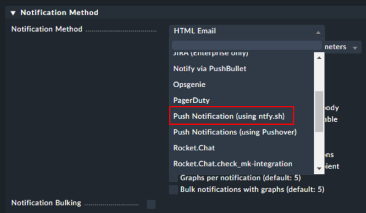

# ntfy.sh Push Notification Script for Checkmk

This script sends push notifications from Checkmk directly to your ntfy.sh server and links each alert to the specific host or service in monitoring. It supports channels, priorities, custom tags, authentication (basic and token), and rich messages.

# General

Since ntfy.sh is our new push notification service and no suitable script was available, this solution was custom-built for robust Checkmk integration.  
Each notification contains a direct link to the affected host or service for instant access in your monitoring interface.


The script is actively maintained and works reliably as of now.

# Installation

Copy the script to your Checkmk server notifications directory and make it executable:

```
$OMD_ROOT/local/share/check_mk/notifications/ntfy.sh
chmod +x $OMD_ROOT/local/share/check_mk/notifications/ntfy.sh
```

After deployment, select **ntfy.sh** as your notification method in Checkmk’s notification settings:



# Configuration

Set up the notification method by supplying the following parameters in the Checkmk GUI:

1.  **ntfy.sh Server:** Hostname of your ntfy.sh server, must use HTTPS
2.  **Channel Name:** Channel created for sorting notifications within ntfy.sh
3.  **Monitoring System URL:** The base URL (domain) of your Checkmk or monitoring system, e.g. `https://monitoring.company.com`
4.  _(Optional)_ Username for basic authentication OR _Token_ (starts with `tk_`) for token auth
5.  _(Optional)_ Password for basic authentication (if required)


# Features

*   Pushes formatted, tagged notifications via ntfy.sh
*   Supports **priority, tag, and action links** (opens Checkmk host/service page directly)
*   Handles **acknowledgements** and states with custom tags (OK, WARN, CRIT, UNKN)
*   Authenticates via **basic auth or bearer tokens**
*   Fail-safe exit status for Checkmk notification logic

# Example Parameter Table

| Parameter | Description | Example |
| --- | --- | --- |
| Server | ntfy.sh server (HTTPS) | ntfy.company.com |
| Channel | Channel name for the notification | monitoring-alerts |
| Monitoring URL | Base URL to Checkmk | [https://monitoring.company.com](https://monitoring.company.com/) |
| Username/Token | Username for basic auth OR token (tk\_...) | tk\_xxx... OR notification\_user |
| Password | Password for basic auth (if needed) | Cringing-Antibody-Unclothed0 |

# Message Details

*   Each notification contains:
    *   State (OK, WARN, CRIT, UNKN, ACKNOWLEDGED)
    *   Site and time info
    *   Service or host details
    *   Direct action link back to monitoring object for rapid troubleshooting

# Troubleshooting

*   Ensure `$OMD_ROOT` points to your Checkmk site root.
*   Make sure the server parameter uses `https://`.
*   Double-check channel names and authentication info.
*   Monitor logs for push errors (exit status > 0).

# Author

*   Author: **Sascha Jelinek**
*   Company: **ADMIN INTELLIGENCE GmbH**
*   Website: [www.admin-intelligence.de/checkmk](https://www.admin-intelligence.de/checkmk)